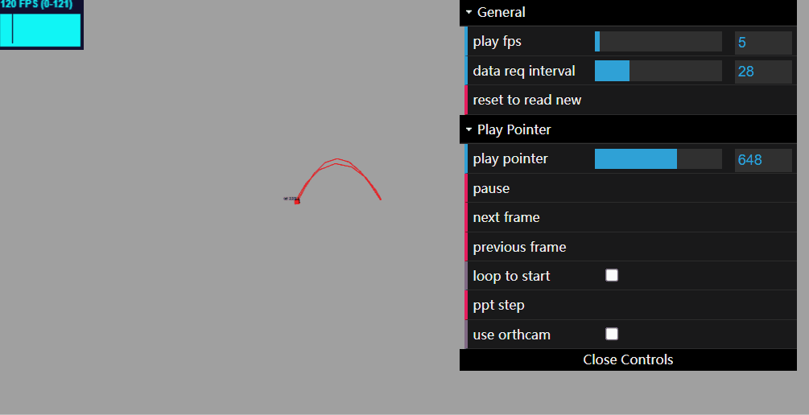

# visual hybrid multi-agent playground (VHMAP 使用说明书)
## 面向场景和特点
面向场景：
- 科研，尤其是多智能体强化学习领域
- 3D演示
- 娱乐

应用特点：
- 服务端依赖少，客户端跨平台
- 占用服务端资源极少
- 渲染在客户端，纵享丝滑帧率

## 安装 
```shell
pip install vhmap
```

## VHMAP的简单、丝滑

该图的效果只需要20行(含初始化)python代码就能实现
```python
from VISUALIZE.mcom import mcom
import numpy as np
class TestVhmap():
    def render(self, t):
        if not hasattr(self, '可视化桥'):
            self.可视化桥 = mcom(path='RECYCLE/v2d_logger/', draw_mode='Threejs')
            self.可视化桥.初始化3D()
            self.可视化桥.设置样式('gray')
            self.可视化桥.其他几何体之旋转缩放和平移('box', 'BoxGeometry(1,1,1)',   0,0,0,  1,1,1, 0,0,0) 

        x = np.cos(t); y=np.sin(t); z= np.cos(t)*np.sin(t)  # 此帧的x,y,z坐标
        self.可视化桥.发送几何体('box|2233|Red|0.1',     # 填入 ‘形状|几何体之ID标识|颜色|大小’即可
            x, y, z, ro_x=0, ro_y=0, ro_z=np.sin(t),    # 三维位置+欧拉旋转变换，六自由度
            track_n_frame=20)                           # 显示历史20帧留下的轨迹
        self.可视化桥.结束关键帧()

if __name__ == '__main__':
    x = TestVhmap()
    for step in range(1000): x.render(t=step/np.pi)
    import time; time.sleep(1000)   # 启动后打开输出的url地址即可
```
## API-中文

引入
```python
from UTILS.tensor_ops import repeat_at, delta_matrix, dir2rad
from VISUALIZE.mcom import mcom
```

初始化
```python
self.可视化桥 = mcom(draw_mode='Threejs')
self.可视化桥.初始化3D()
```


声明几何体
```python
# declare geo 'oct1', init with OctahedronGeometry, then (1)rotate & (2)scale & (3)translate
self.可视化桥.其他几何体之旋转缩放和平移('oct1', 'OctahedronGeometry(1,0)', 0,0,0,  1,1,1, 0,0,0)   # 八面体
# 需要换成其他几何体，请把'OctahedronGeometry(1,0)'替换，参考网址 https://threejs.org/docs/index.html?q=Geometry
self.可视化桥.其他几何体之旋转缩放和平移('any_name_you_want', 'TorusGeometry(10,3,16,100)',   0,0,0,  1,1,1, 0,0,0) # 甜甜圈
# declare geo 'ball'
self.可视化桥.其他几何体之旋转缩放和平移('ball', 'SphereGeometry(1,1,1)',   0,0,0,  1,1,1, 0,0,0) # 球体
# declare geo 'box'
self.可视化桥.其他几何体之旋转缩放和平移('box', 'BoxGeometry(1,1,1)',   0,0,0,  1,1,1, 0,0,0) # 长方体

```

发送几何体
```python
self.可视化桥.发送几何体(
    'ball|8848|MidnightBlue|0.5'%(0, color, size),  # 填入核心参量： “已声明的形状|几何体之ID标识|颜色|整体大小”
    pos[i__,0], pos[i__,1], 0,          # 三维位置，3/6dof
    ro_x=0, ro_y=0, ro_z=0, # 欧拉旋转变换，3/6dof
    opacity=1,              # 透明度，1为不透明
    label='',               # 显示标签，空白不显示
    label_color='white',    # 标签颜色
    track_n_frame=3,        # 是否显示轨迹（0代表否），轨迹由最新的track_n_frame次位置连接而成
    track_tension=0.1,      # 轨迹曲线的平滑度，0为不平滑，推荐不平滑
    track_color='green',    # 轨迹的颜色显示，输入js颜色名或者hex值均可
    )
```

终结这一帧（并开始下一帧）
```python
self.可视化桥.结束关键帧()
```

## API-ENG
Option 1 ENG
```python
    self.vhmap_bridge = mcom(draw_mode='Threejs')
    self.vhmap_bridge.v2d_init()
```

```python
# declare geo 'oct1', init with OctahedronGeometry, then (1)rotate & (2)scale & (3)translate
self.vhmap_bridge.advanced_geometry_rotate_scale_translate('oct1', 'OctahedronGeometry(1,0)', 0,0,0,  1,1,1, 0,0,0)
# why 'OctahedronGeometry(1,0)', please see https://threejs.org/docs/index.html?q=Geometry
# e.g. 
# self.threejs_bridge.advanced_geometry_rotate_scale_translate('Tor', 'TorusGeometry(10,3,16,100 )',   0, 0, 0,  1,1,1, 0,0,0)
```